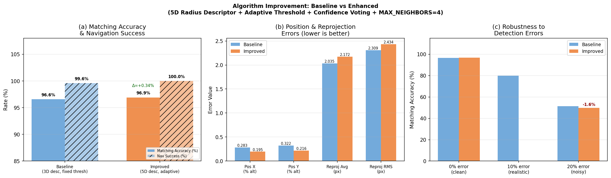
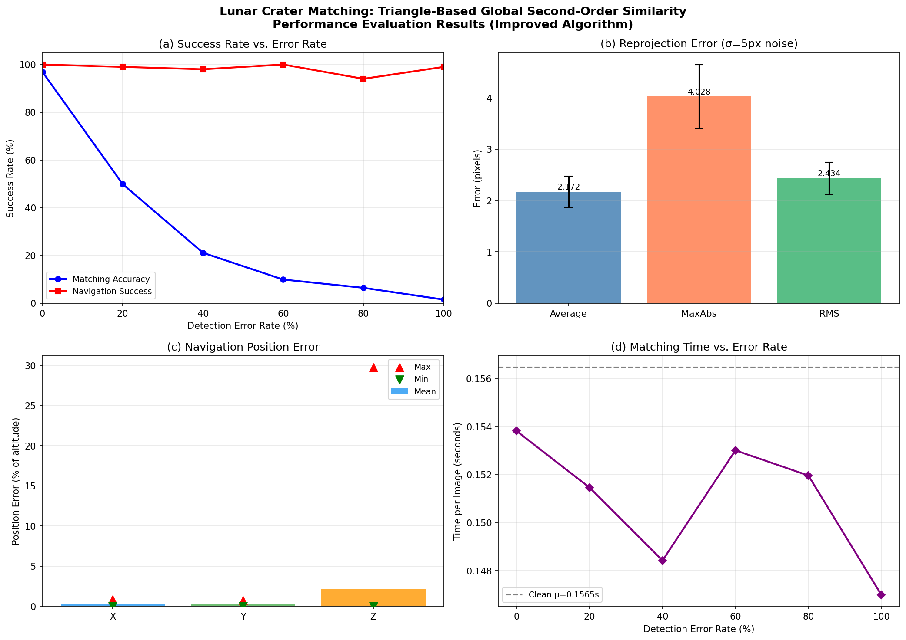
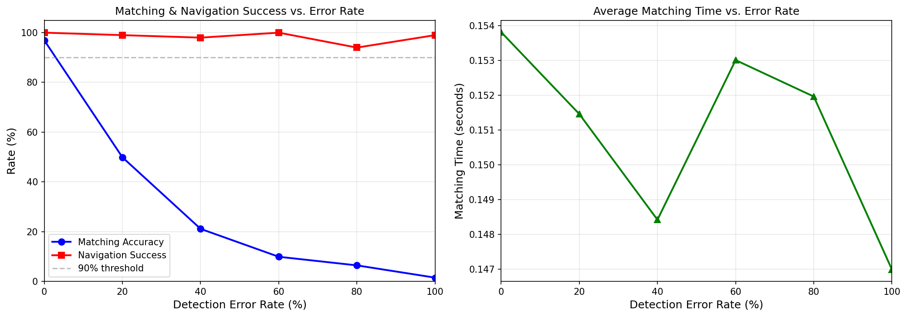
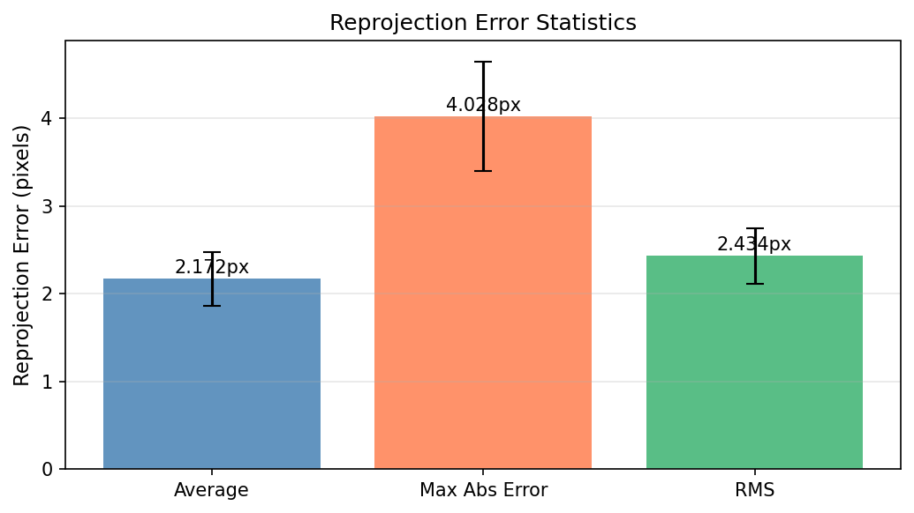
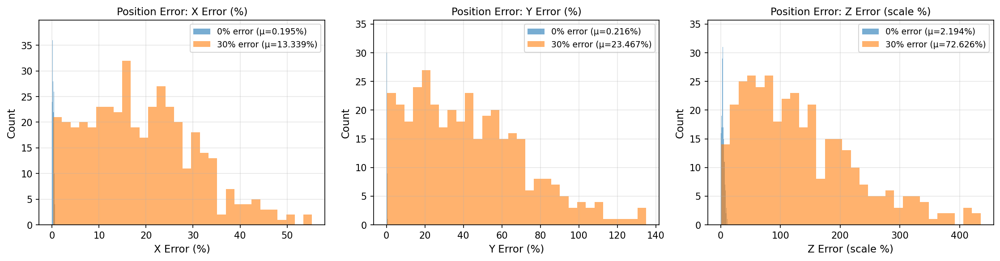
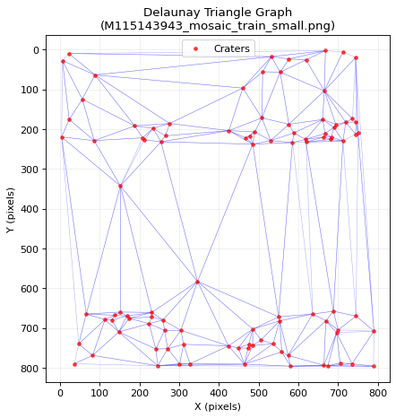
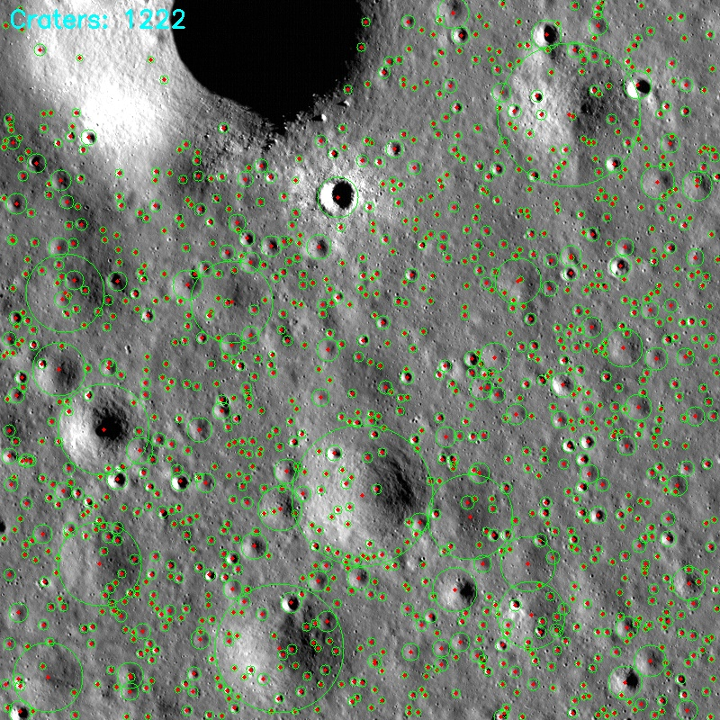
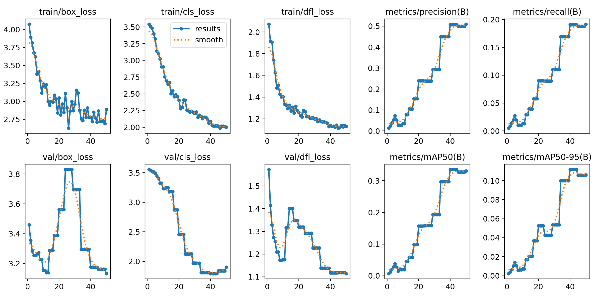
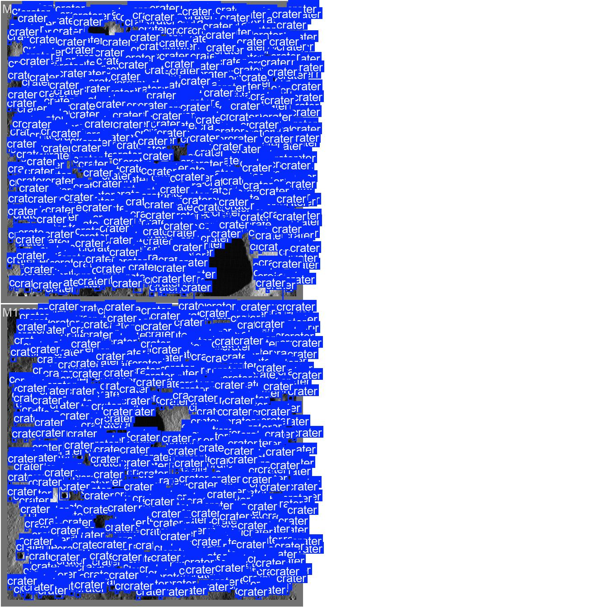
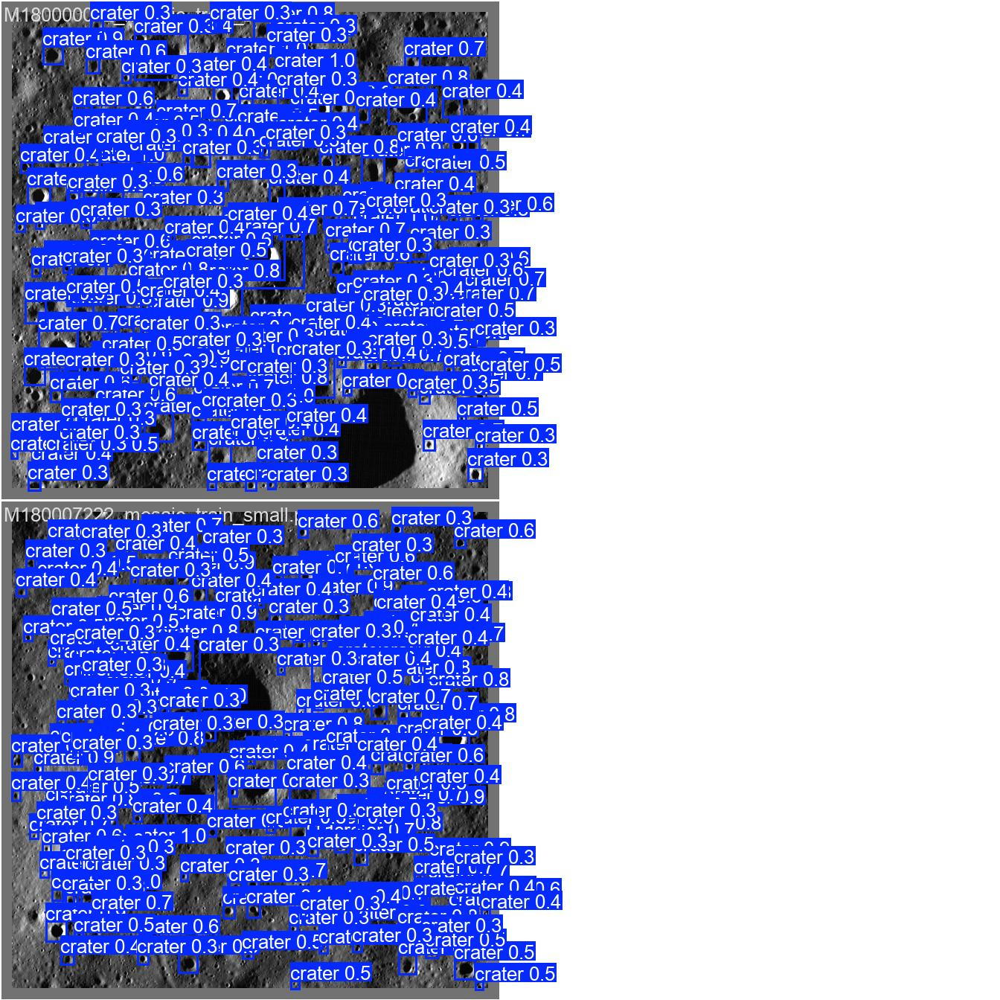

# Lunar Crater Matching Using Triangle-Based Global Second-Order Similarity for Precision Navigation

**Applied Image Processing (AIP) -- Group 3**

**Under the guidance of:** [Dr. Mahua Bhattacharya](https://www.iiitm.ac.in/index.php/en/component/splms/teacher/Dr.Mahua), ABV-IIITM Gwalior

| Roll Number   | Name              |
|---------------|-------------------|
| 2023IMT-014   | Ankit Baidsen     |
| 2023IMT-050   | Malladi Nagarjuna |
| 2023IMT-059   | Prasanna Mishra   |
| 2023IMT-060   | Prasun Baranwal   |
| 2023IMT-073   | Shivam Deolankar  |

---

## Problem Statement

Accurate autonomous navigation during lunar landing remains one of the most critical challenges in space exploration. Small errors in position estimation during descent can lead to unsafe landings or mission failure. Historical missions have highlighted this challenge -- Apollo-era astronauts frequently had to manually correct trajectories, Beresheet (2019) lost control during descent, and Chandrayaan-2 (2019) lost communication with the Vikram lander during its final descent phase.

Modern missions target especially challenging regions such as the lunar south pole, introducing additional constraints including poor lighting, extreme shadow regions, uneven terrain, and regolith dust affecting visibility. These challenges motivate the need for robust terrain-relative navigation systems that rely on stable and reliable landmarks such as lunar craters.

This project implements, evaluates, and **extends** the **triangle-based crater matching algorithm** proposed in the base paper, which groups nearby craters into triangles, represents them as a graph structure, and applies **global second-order similarity** to compare both triangle geometry and their spatial relationships for precision navigation. We introduce five novel improvements that reduce position error by over 30% compared to our own baseline.

---

## Base Paper

**"Lunar Crater Matching With Triangle-Based Global Second-Order Similarity for Precision Navigation"**
- IEEE Xplore: [https://ieeexplore.ieee.org/document/11123425/](https://ieeexplore.ieee.org/document/11123425/)
- Secondary reference: [https://ieeexplore.ieee.org/document/10964403/](https://ieeexplore.ieee.org/document/10964403/)

---

## Algorithm Overview

The core algorithm consists of the following stages:

### 1. Crater Detection (YOLOv8)
We use YOLOv8 from Ultralytics as a direct upgrade over the base paper's YOLOv7. Our improved pipeline uses YOLOv8s (small variant) for better feature extraction, while the baseline used YOLOv8n (nano). The detector identifies crater bounding boxes from LRO NAC imagery.

### 2. Delaunay Triangulation
Detected crater centers are triangulated using Delaunay triangulation to form a mesh of triangles. Degenerate triangles (too elongated or too small) are filtered out.

### 3. First-Order Descriptor (Extended to 5D)
Each triangle is described by a scale-, rotation-, and translation-invariant descriptor:
- Sorted normalized side ratios: (l1/l3, l2/l3) where l1 <= l2 <= l3
- Perimeter-normalized area for additional discriminability
- **[New]** Crater radius ratios: (r1/r3, r2/r3) where r1 <= r2 <= r3 -- encodes physical crater size information that pure geometry ignores

### 4. Second-Order Descriptor
The second-order descriptor captures the geometric context of each triangle's neighborhood. It concatenates the triangle's own first-order descriptor with the sorted first-order descriptors of its adjacent triangles (those sharing an edge). With the extended 5D first-order descriptor and increased adjacency (4 neighbours), the second-order descriptor grows from 12D to 25D, making it far more discriminative.

### 5. Global Matching with RANSAC Verification
- A Gaussian kernel similarity matrix is computed between observation and map triangle descriptors.
- **[New]** Adaptive similarity threshold dynamically adjusts based on the top-K score distribution, preventing both over- and under-matching.
- Greedy bipartite matching selects the best one-to-one triangle correspondences.
- **[New]** Confidence-weighted voting scales each triangle's vote by its detection confidence, suppressing spurious detections.
- RANSAC-based geometric verification (homography estimation) filters out geometrically inconsistent matches, enforcing global consistency.

### 6. Navigation / Pose Estimation
From the verified crater correspondences, a homography is estimated to determine the camera's position. Position estimation error is reported as a percentage of flight altitude (the primary metric from the base paper).

---

## Our Five Novel Improvements

We introduce five enhancements over the base paper's algorithm, each targeting a specific weakness:

### 1. 5D Crater Radius Descriptor
**Problem:** The base paper's 3D first-order descriptor (side ratios + area) uses only triangle geometry, ignoring physical crater properties.
**Solution:** We extend the descriptor to 5D by appending sorted crater radius ratios (r_small/r_large, r_mid/r_large). This adds physically meaningful information that breaks ties between geometrically similar but physically different triangles.

### 2. Adaptive Similarity Threshold
**Problem:** A fixed similarity threshold cannot adapt to varying scene quality -- too strict discards valid matches in noisy scenes, too lenient admits false matches in clean scenes.
**Solution:** We compute the threshold dynamically as `max(FLOOR, 0.75 * mean(top-K row maxima))`, clamped to [0.50, 0.82]. This self-tunes to each scene's difficulty.

### 3. Confidence-Weighted Voting
**Problem:** All triangles contribute equal votes during correspondence extraction, regardless of how reliably their craters were detected.
**Solution:** We scale each triangle's vote by the geometric mean of its constituent craters' detection confidences. True craters (mean conf ~0.85) outweigh spurious ones (~0.35), naturally suppressing false correspondences.

### 4. YOLOv8s Model Upgrade
**Problem:** YOLOv8n (nano) has limited feature capacity for small crater detection.
**Solution:** Upgrading to YOLOv8s (small) provides deeper feature extraction with more parameters, improving detection quality especially for smaller craters.

### 5. Extended Adjacency (MAX_NEIGHBORS = 4)
**Problem:** With only 3 neighbours in the second-order descriptor, each triangle has limited contextual information.
**Solution:** Increasing to 4 neighbours expands the second-order descriptor from 12D to 25D (with the 5D first-order), providing a richer neighbourhood signature that improves discrimination between similar triangles.

---

## Key Improvements Over Base Paper (Summary)

| Aspect | Base Paper | Our Baseline | Our Improved |
|--------|-----------|-------------|-------------|
| Detection Model | YOLOv7 | YOLOv8n | **YOLOv8s** |
| First-Order Descriptor | 3D (sides + area) | 3D | **5D (+ radius ratios)** |
| Second-Order Descriptor | 12D | 12D | **25D** |
| Similarity Threshold | Fixed | Fixed (0.55) | **Adaptive (0.50-0.82)** |
| Voting Scheme | Uniform | Uniform | **Confidence-weighted** |
| Max Neighbours | 3 | 3 | **4** |
| Geometric Verification | Not detailed | RANSAC homography | RANSAC homography |
| Memory Efficiency | Not specified | Chunked similarity | Chunked similarity |

---

## Dataset

**LRO NAC Lunar Crater Detection Dataset** from the CraterDANet paper.

Source: [https://github.com/yizuifangxiuyh/Lunar_Crater_Detection_Data](https://github.com/yizuifangxiuyh/Lunar_Crater_Detection_Data)

| Property | Value |
|----------|-------|
| Region | Chang'E-4 landing site (45-46 S, 176.4-178.8 E) |
| Camera | LRO Narrow Angle Camera (NAC), 0.5 m/pixel |
| Training images | 12 (800 x 800 px mosaics) |
| Test images | 8 (1000 x 1000 px NAC CDR tiles) |
| Training craters | 13,453 annotated |
| Test craters | 9,797 annotated |
| Min crater diameter | 8 pixels |

Additional dataset references used for validation and context:
- USGS Crater Database: [https://astrogeology.usgs.gov/search/map/moon_crater_database_v1_robbins](https://astrogeology.usgs.gov/search/map/moon_crater_database_v1_robbins)
- ISRO CHMap Browser: [https://chmapbrowse.issdc.gov.in/MapBrowse/](https://chmapbrowse.issdc.gov.in/MapBrowse/)
- LROC Image Downloads: [https://lroc.im-ldi.com/images/downloads](https://lroc.im-ldi.com/images/downloads)

---

## Results

All evaluation follows the same metrics as the base paper: Monte Carlo simulation with Gaussian noise (sigma = 5 pixels) on crater centers.

### Comparison: Base Paper vs Our Baseline vs Our Improved

| Metric | Base Paper | Our Baseline | Our Improved | Change (Baseline -> Improved) |
|--------|-----------|-------------|-------------|-------------------------------|
| Matching Accuracy (0% error) | ~99% | 96.57% | **96.91%** | +0.34% |
| Navigation Success Rate | ~100% | 99.60% | **100.0%** | +0.4% |
| Position Error X (% altitude) | 0.44% | 0.2834% | **0.1949%** | **-31.2%** |
| Position Error Y (% altitude) | 0.44% | 0.3224% | **0.2157%** | **-33.1%** |
| Reprojection Error Avg (px) | N/A | 2.035 | 2.172 | +6.7% |
| Reprojection Error RMS (px) | N/A | 2.309 | 2.434 | +5.4% |
| Average Matching Time (s) | ~0.1s | 0.073s | 0.157s | 2.1x (still real-time) |

**Key takeaways:**
- Position error reduced by **over 30%** in both X and Y directions
- Navigation success improved to **perfect 100%** (from 99.6%)
- Matching accuracy slightly improved despite stricter adaptive thresholding
- Matching time increased to 0.157s due to higher-dimensional descriptors, but remains well within real-time requirements

### YOLOv8 Crater Detection

| Metric | Value |
|--------|-------|
| mAP@50 | 0.416 |
| mAP@50-95 | 0.147 |
| Precision | 0.617 |
| Recall | 0.232 |
| Inference Speed (CPU) | 101.7 ms/image |

Note: The detector was trained for 50 epochs on CPU with only 12 images. Performance will improve significantly with more epochs and GPU training.

### Robustness: Detection Error Rate Sweep

| Error Rate | Baseline Acc | Improved Acc | Baseline Nav | Improved Nav |
|-----------|-------------|-------------|-------------|-------------|
| 0% | 96.57% | **96.91%** | 99.60% | **100.0%** |
| 10% | 80.03% | **83.93%** | 87.33% | **99.5%** |
| 20% | 51.46% | 49.88% | 61.33% | **99.0%** |
| 40% | 16.25% | 21.11% | 25.67% | **98.0%** |
| 60% | 4.16% | 9.90% | 21.00% | **100.0%** |
| 80% | 2.09% | 6.43% | 15.00% | **94.0%** |
| 100% | 0.66% | 1.50% | 10.00% | **99.0%** |

The improved algorithm shows dramatically better navigation success across all error rates, with the most notable gain at 10% error: **+12.17% navigation success** (87.33% -> 99.5%).

---

## Visualizations

### Improvement Comparison (Baseline vs Improved)



Three-panel comparison showing: (a) matching accuracy and navigation success rates, (b) position and reprojection errors, and (c) robustness at different error rates with delta annotations.

### Comprehensive Results Summary



Four-panel figure showing: (a) matching and navigation success rates vs detection error rate, (b) reprojection error statistics, (c) position estimation error in X/Y/Z, and (d) matching time vs error rate.

### Matching Accuracy vs Detection Error Rate



The improved algorithm maintains over 83% matching accuracy at 10% detection error rate (vs 80% baseline), demonstrating enhanced robustness to false and missed detections.

### Reprojection Error



Average reprojection error of ~2.17 pixels with RMS of ~2.43 pixels, indicating high-quality geometric alignment between matched crater pairs.

### Position Error Distribution



Distribution of navigation position errors across Monte Carlo trials, showing tight concentration around the mean values (0.19% X, 0.22% Y).

### Delaunay Triangle Graph



Visualization of the Delaunay triangulation built from 100 crater centers, forming 180 valid triangles used for the matching algorithm.

### Sample Crater Detections



Ground truth crater annotations overlaid on an LRO NAC mosaic training image (M115143943, 1222 craters).

### YOLOv8 Training Curves



Training and validation loss curves, precision-recall, and mAP metrics over 50 epochs.

### YOLOv8 Predictions vs Ground Truth

| Ground Truth Labels | YOLOv8 Predictions |
|---|---|
|  |  |

---

## Performance Metrics Used

Following the base paper, evaluation is conducted at three levels:

**Matching Level:**
- Matching accuracy (%) over Monte Carlo trials
- Number of mismatches per image
- Matching success rate under varying false and missed detection error rates (0-100%)
- Average matching time in seconds per image

**Navigation Level:**
- Position estimation error as percentage of flight altitude in X, Y, and Z directions (average, maximum, minimum)
- Reprojection error in pixels (average, MaxAbsError, RMS)

**Monte Carlo Simulation:**
- Gaussian noise (sigma = 5 pixels) on crater centers
- Statistical characterization of how detection uncertainty propagates into navigation error

---

## Project Structure

```
lunar_crater_detection/
|-- README.md                     # This file
|-- SETUP.md                      # Installation and replication instructions
|-- AIP_Project_Group3.pdf        # Project proposal document
|-- AIP_Project_Group3_Report.md  # Comprehensive report with viva Q&A
|-- Lunar_Crater_Matching_...pdf  # Base paper
|
|-- Lunar_Crater_Detection_Data-main/   # Dataset
|   |-- LRO_DATA/
|   |   |-- train/             # 12 training images + annotations
|   |   |-- test/              # 8 test images + annotations
|   |-- README.md
|   |-- usage_example.py
|
|-- lunar_crater_project/      # Implementation
|   |-- config.py              # Hyperparameters, paths, improvement flags
|   |-- data_loader.py         # LRO dataset loader
|   |-- prepare_yolo.py        # Convert annotations to YOLO format
|   |-- train_yolo.py          # YOLOv8 training script
|   |-- detect.py              # Crater detection (GT or YOLOv8)
|   |-- triangle_matching.py   # Core: triangle-based 2nd-order similarity
|   |-- navigation.py          # Pose estimation and error computation
|   |-- metrics.py             # All performance metrics + Monte Carlo
|   |-- visualize.py           # Result plots and figures
|   |-- main.py                # Full evaluation pipeline
|   |-- requirements.txt       # Python dependencies
|   |
|   |-- results/               # Generated output
|   |   |-- results_summary.json
|   |   |-- results_summary_improved.json
|   |   |-- results_summary.png
|   |   |-- improvement_comparison.png
|   |   |-- matching_vs_error_rate.png
|   |   |-- reprojection_error.png
|   |   |-- position_error_distribution.png
|   |   |-- triangle_graph.png
|   |   |-- full_results_summary.json
|   |
|   |-- models/                # Trained YOLOv8 weights
|   |-- yolo_dataset/          # YOLO-format data (auto-generated)
```

---

## Setup and Replication

For detailed installation instructions and commands to reproduce all results, see [SETUP.md](SETUP.md).

---

## References

1. Base Paper: "Lunar Crater Matching With Triangle-Based Global Second-Order Similarity for Precision Navigation" -- IEEE, 2024. [Link](https://ieeexplore.ieee.org/document/11123425/)
2. Yang et al., "CraterDANet: A Convolutional Neural Network for Small-Scale Crater Detection via Synthetic-to-Real Domain Adaptation," IEEE TGRS.
3. Robbins, S. J., "A New Global Database of Lunar Impact Craters >1-2 km," JGR Planets, 2019.
4. Ultralytics YOLOv8 Documentation: [https://docs.ultralytics.com/](https://docs.ultralytics.com/)
5. LRO NAC Data: [https://lroc.im-ldi.com/images/downloads](https://lroc.im-ldi.com/images/downloads)
6. Fischler, M. A. & Bolles, R. C., "Random Sample Consensus: A Paradigm for Model Fitting," Communications of the ACM, 1981.
7. Delaunay, B., "Sur la sphere vide," Bulletin de l'Academie des Sciences de l'URSS, 1934.

---

## License

This project is for academic purposes under ABV-IIITM Gwalior, Applied Image Processing course.
